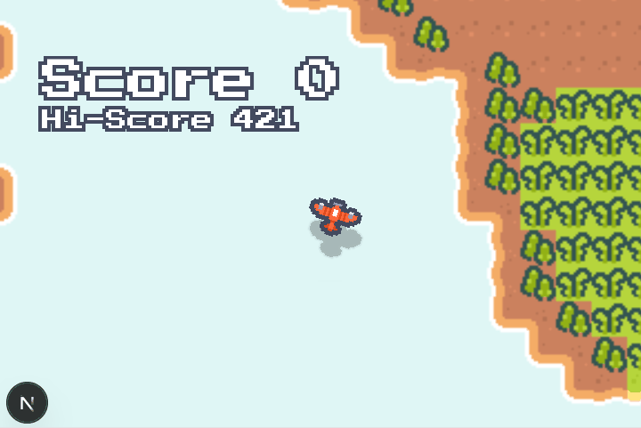

# Projeto: Aplicação com persistência de dados em backend



## Acesso

https://project2-2026b-alexandre-chagas-brites.vercel.app/

## Desenvolvedor(a)

Alexandre Chagas Brites - Ciência da Computação

## Proposta

Modalidade A. Desenvolvimento de um jogo simples demonstrando multiplayer em tempo real.

## Parceria/cliente/usuário

Victor Mateus Severo Ferreira

## Feedback/comentário da parceria/cliente/usuário

Substitua este texto por um feedback produzido pelo(a) colega parceiro(a). Na modalidade A (parceria dev), o foco principal do feedback/comentário estará nas diferenças percebidas no código. Na modalidade B (parceria cliente/usuário), o foco principal do feedback/comentário estará nas funcionalidades/interface.

## Desenvolvimento

### Processo

Comecei o projeto desenvolvendo o jogo diretamente em HTML, CSS, JavaScript. Após ter o jogador se movendo pelo mapa, converti o projeto para Next.js, adicionei a database para fazer a sincronização entre jogadores e refatorei o código com tipos do TypeScript. São tecnologias que nunca utilizei antes, porém o uso do React acabou sendo mínimo, já que o jogo em si é só manipulação do canvas. Como o RTT da database é alto pra um jogo desse tipo, tive um trabalho para minimizar a diferença entre as posições dos jogadores. A solução que melhor funcionou foi de predição no cliente usando dead reckoning e o uso do serverTime para marcar as atualizações no servidor com o timestamp.

### Trechos de código

Indique pelo menos 3 trechos de código que você queira destacar para a turma (por exemplo, para explicar algo que aprendeu, para alertar sobre alguma dificuldade de compreensão, para mostrar uma curiosidade, etc).

Tempo estimado do Servidor:

```
let offsetVal = 0.0;
const offsetRef = ref(db, ".info/serverTimeOffset");
onValue(offsetRef, (data: any) => {
    offsetVal = data.val() || 0.0;
});

const localTime = new Date().getTime() + offsetVal;
const remoteTime = ...;
const timeDiff = (localTime - remoteTime) / 1000.0;
```

Game Loop:

```
const onAnimationFrame = (timestamp: DOMHighResTimeStamp) => {
    if (game.timestamp !== undefined) {
        const deltatime = timestamp - game.timestamp;
        onStep(game, deltatime / 1000.0);
    }
    game.timestamp = timestamp;

    onRender(game);
    game.requestId = requestAnimationFrame(onAnimationFrame);
};

game.requestId = requestAnimationFrame(onAnimationFrame);
```

Lifecycle dos Objetos:

```
const objectRef = push(ref(game.db, "objects"));
onDisconnect(objectRef).remove();
```

## Tecnologias

### Linguagens e afins

Substitua este trecho por uma lista detalhada de tecnologias utilizadas:
- Next.js
- TypeScript
- Firebase Realtime Database
- Vercel

### Ambiente de desenvolvimento

Substitua este trecho por uma lista detalhada dos ambientes/ferramentas de desenvolvimento que você usou (por exemplo, VS Code + alguma extensão, agentes de IA, etc.)
- VS Code
- Google AI Overview

## Referências e créditos

- https://developer.mozilla.org/en-US/docs/Web/API
- https://nextjs.org/docs
- https://firebase.google.com/docs/database/web/start
- https://www.youtube.com/watch?v=rQvOAnNvcNQ
- https://www.youtube.com/watch?v=pP7quzFmWBY
- https://vercel.com/docs
- https://kenney.nl/assets/pixel-shmup
- https://gafferongames.com/post/fix_your_timestep/

---
Projeto entregue para a disciplina de [Desenvolvimento de Software para a Web](http://github.com/andreainfufsm/elc1090-2026b) em 2026b
